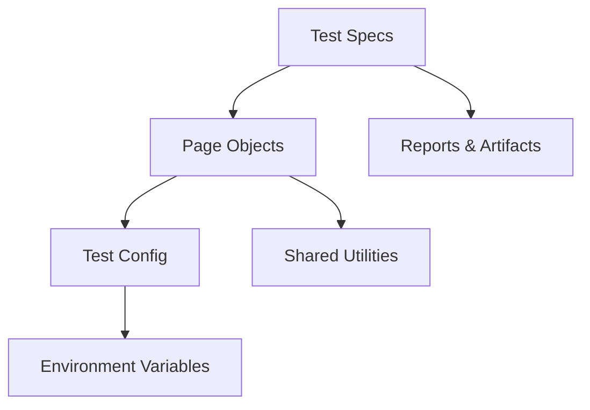

# Flight Booking E2E Automation (Playwright)


Production-style end-to-end automation for flight-booking workflows using Page Object Model (POM), reusable helpers, and CI-friendly execution.

## Why This Looks Senior

- Business-critical flow coverage (auth, search, booking, checkout, payment transition)
- Stable design with maintainable POM boundaries
- Explicit handling for flaky/real-world UI states
- Security-conscious setup with environment-driven test data (no hardcoded credentials)

## Architecture



## Test Strategy

- **Smoke:** Core booking path health check per deployment.
- **Regression:** Multi-step happy/negative journeys for stable release confidence.
- **Resilience:** Timeout modal, no-flight, and interruption handling.
- **Data strategy:** Placeholder-safe defaults + env overrides for CI/stage.
- **Release gate:** Run in CI with HTML report and failure artifacts.

## Project Structure

```text
automation-test/
├── config/
├── pages/
├── tests/
├── .env.example
├── playwright.config.js
└── package.json
```

## Setup

```bash
npm install
npx playwright install
cp .env.example .env
```

## Run

```bash
npm run test
npm run test:headed
npm run test:debug
```

## Security Notes

- No real credentials, OTPs, or discount codes are committed.
- Use `.env` locally and CI secret variables in pipelines.
- Keep stage/production secrets outside source control.
